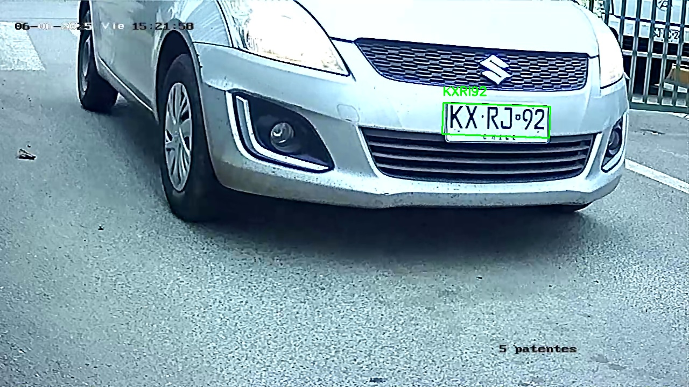
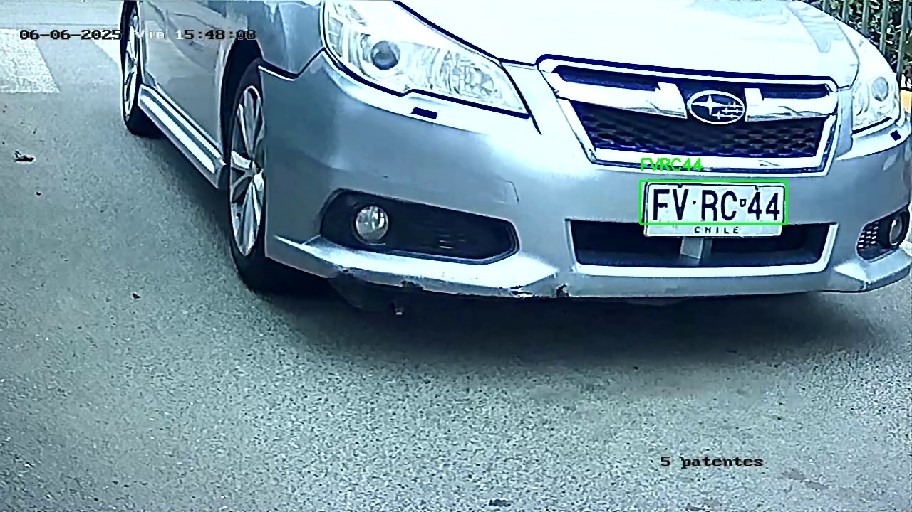
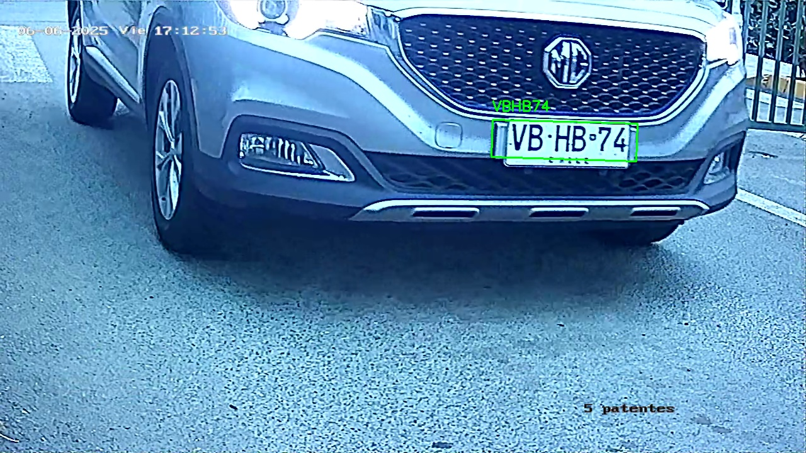

# Lectora de patentes chilenas de autos
## Lectora de matriculas de autos

Trabajo basado en los desarrollos abajo explicados, ataptado a trabajo con patentes chilenas y adecuado para trabajar con camaras ip ONVIF

el ultimo cambio esta en test4_rtsp_alta_calidad donde se agrego el argumento -C para procesar el flujo tal cual usa en mi caso 26% de cpu (xeon 2.4GHz) por lo cual no lo recomiendo mucho si usas algo mas umilde.

ademas se agrego un manejo de multiproceso para que no sea tan lento aprovechando que los CPU atuales son multi hilo

espero puedan provarlo, en lo personal no use el docker ya que esta en un flujo RTSP pero tambien pueden compilarlo

para evitar usar docker, use anaconda que permite montar un entono python 3.8 limpio.

espero les ayude, este proyecto fue echo para mejorar la seguridad y registrar todo tipo de vehicúlos.

Pronto nuevas mejoras  ya son las 4:40 de la madrugada asi que buenas noches.

Hola a todos, espero que estén bien. Estamos trabajando en una nueva versión, ahora con optimizacion de CPU y mejoras en el rendimiento. ahora no trata de procesar todo el flujo de video, sino solo los frames que se detectan como vehículos. Esto debería mejorar el rendimiento.
Por favor, si tienen alguna pregunta o necesitan más información sobre esta versión, no dudes en preguntar. Estamos trabajando duro para que esta versión sea la mejor posible.

>algunos ejemplos de como se detectan las placas en el video:

  
  
  
  
  
  
  
  
  
  
  
  
  
  
  
  
  
  
  
  
  
  
  
  
  
  
  
  
  
  
  
  
  
  
  
  
  
  
  
  
  
  
  
  
  
  
  
  
  
  
  
  
  
  
  
  
  
  

## Aqui un pequeño video del proyecto

ejemplo de video con una imagen que linkea a un video en youtube

## License Plate Detection

This project is done as a Final Year Project required to complete a Bachelor's degree in Electronics Engineering. The code is based on Adrian Rosebrock's (@jrosebr1) PyImageSearch post [**OpenCV: Automatic License/Number Plate Recognition (ANPR) with Python**](https://www.pyimagesearch.com/2020/09/21/opencv-automatic-license-number-plate-recognition-anpr-with-python/), edited to be able to detect Malaysian license plates which typically has white texts on black background plate. I recommend reading through his blogpost to get a general idea of how the image processing pipeline works.

The project aims to:

- Automatically detects either Malaysian license plates or other oversea license plates
- Compare Scharr operator, Canny edge detector, and edge-less approach to detect license plates

## Prerequisites

The project code utilizes the following tools:

- [Docker](https://www.docker.com/)
- [Python](https://www.python.org/) v3.8.6
- [OpenCV](https://opencv.org/) v4.4.0.46
- [imutils](https://github.com/jrosebr1/imutils) v0.5.3
- [scikit-image](https://scikit-image.org/) v0.17.2
- [pytesseract](https://github.com/madmaze/pytesseract) v0.3.6
- [Tesseract-OCR](https://tesseract-ocr.github.io/tessdoc/) v5.0.0 (alpha)

## How it works

1. The project has 2 modules which is the driver and the class module named **anprdriver.py** and **anprclass.py** respectively. The driver module contains the script which the user should execute through Python while providing the arguments whereas the class module contains the three detection algorithm (Sobel, Canny, and edge-less) and other functions including saving results and workflow debug display.
2. The driver should be executed in a terminal by using Python (`$ python3 anprdriver.py ...`). The arguments which could be appended are (arguments in bold are required):
   - **`-i` (input)** - path to input directory of images
   - `-c` (clear border) - should the script clear border pixels before performing OCR (default is -1, set to 1 to enable)
   - `-p` (PSM) - default tesseract page segmentation mode for license plate OCR (default is 7)
   - `-d` (debug) - should additional visualizations be shown (default is -1, set to 1 to enable)
   - `-a` (algorithm) - specify which algorithm to use (default is 1, 1 for Scharr, 2 for Canny, 3 for edge-less)
   - `-s` (save) - whether to save the results or not (default is -1, _disable debug_ and set to 1 to enable)
   - `-m` (morphology) - specify morphological operation (default is 1, 1 for black hat which is better for black text on white plates, 2 for top hat which is better for the opposite)
3. The repository includes sample images of license plates in `malaysian` and `overseas` folder. Results are saved inside `result_canny_*`, `result_sobel_*`, and `result_edgeless_*` folders respectively where `*` is either `malaysian` or `overseas`.

## Typical usage

Build the Docker image `docker build -t anpr .` first then run in interactive mode `docker run -it anpr`.

The script can then be typically run by typing `$ python3 anprdriver.py -i /path/to/images/` in the container terminal. Path to the images can be written as `-i /malaysian` for example. While only -i argument is necessary, be sure to choose the correct algorithm (-a) and morphological operation (-m) as needed.

You can also include your own source image by modifying the Dockerfile.
